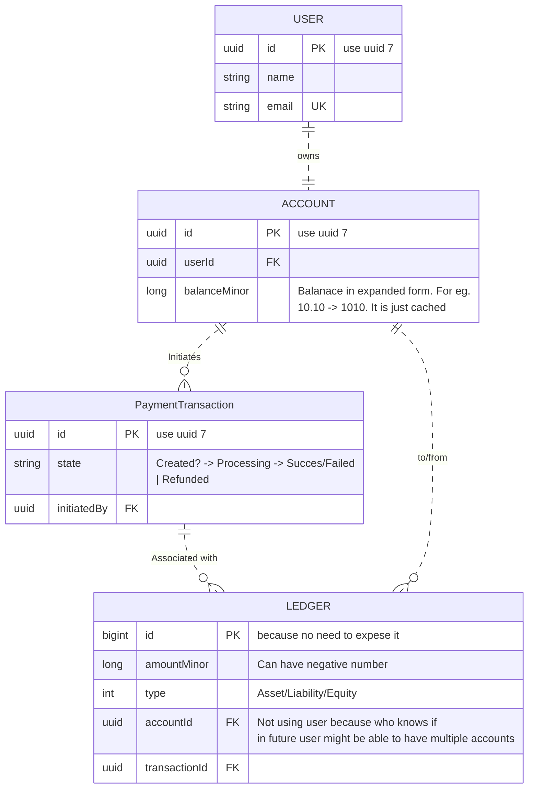

# Entities and their relationship

```mermaid
erDiagram

USER {
    uuid id PK "use uuid 7"
    string name
    string email UK
}

ACCOUNT {
    uuid id PK "use uuid 7"
    uuid userId FK
    long balanceMinor "Balanace in expanded form. For eg.
    10.10 -> 1010. It is just cached"
}

LEDGER {
    bigint id PK "because no need to expese it"
    long amountMinor "Can have negative number"
    int type "Asset/Liability/Equity"
    uuid accountId FK "Not using user because who knows if
    in future user might be able to have multiple accounts"
    uuid transactionId FK
}

PaymentTransaction {
    uuid id PK "use uuid 7"
    string state "Created? -> Processing -> Succes/Failed
    | Refunded"
    uuid initiatedBy FK
}

%% For now its 1:1 but later it'll be 1:M
USER||..||ACCOUNT: owns
LEDGER}o..||ACCOUNT: "to/from"
%% TODO: For now ledger will always be associated with
%% PaymentTransaction but after reconciliation is
%% implemented it'll be |o instead
PaymentTransaction||..o{LEDGER: "Associated with"
ACCOUNT||..o{PaymentTransaction: Initiates
```

<!-- vim: set colorcolumn=60 : -->
