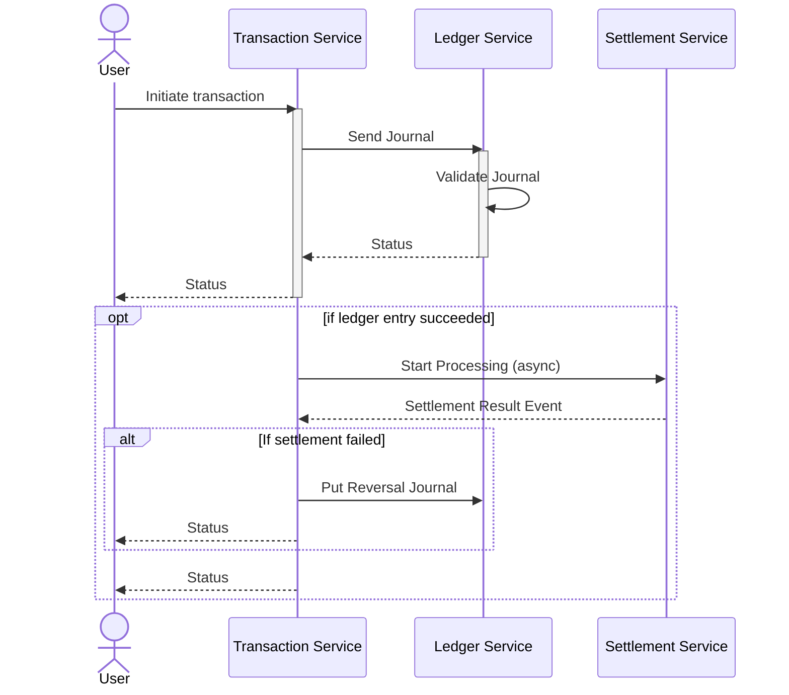

# Sequence Diagram

```mermaid
sequenceDiagram
    actor User
    participant TS as Transaction Service
    participant LS as Ledger Service
    participant SS as Settlement Service
    
    User->>TS: Initiate transaction

    activate TS
    TS->>LS: Send Journal
    activate LS
    LS->>LS: Validate Journal
    LS-->>TS: Status
    deactivate LS
    TS-->>User: Status
    deactivate TS
    
    # Conditional if true
    opt if ledger entry succeeded
        TS->>SS: Start Processing (async)
        SS-->>TS: Settlement Result Event
            alt If settlement failed 
                TS->>LS: Put Reversal Journal
                TS-->>User: Status
            end
        TS-->>User: Status
    end
```